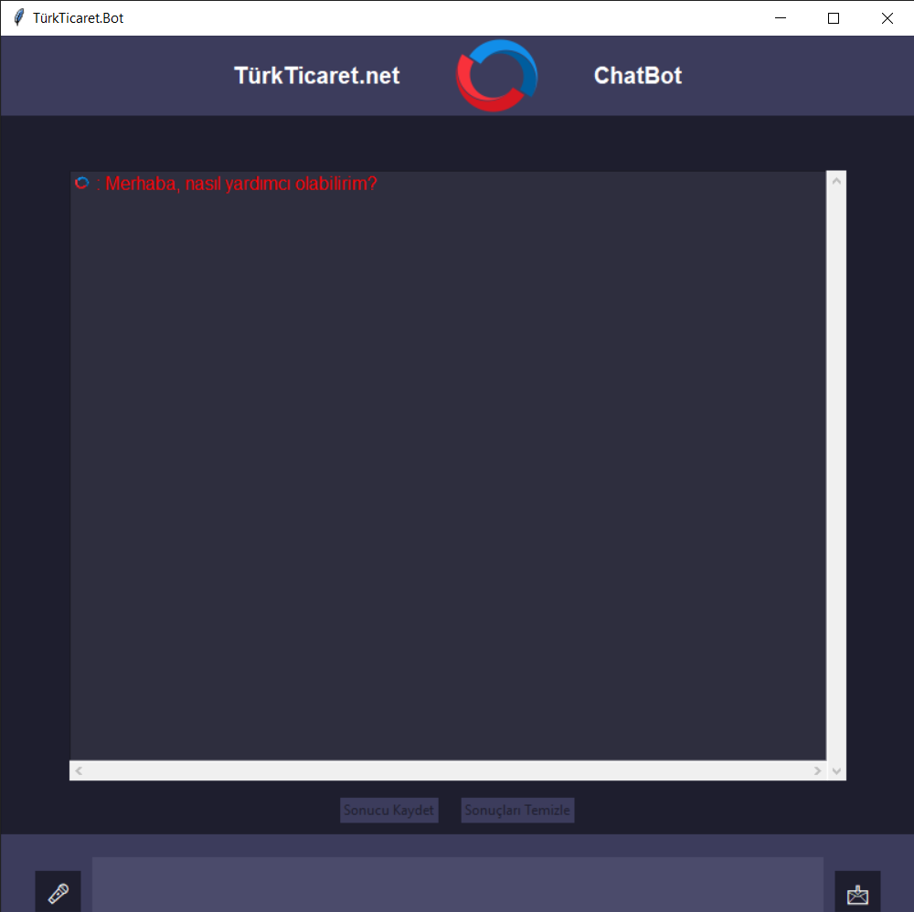
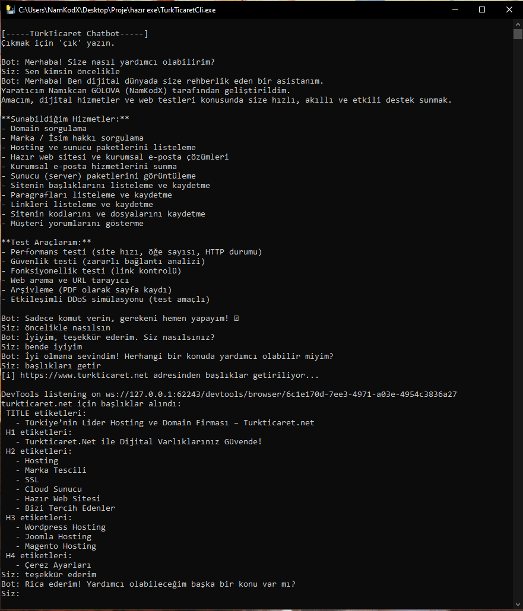

# TürkTicaret.Net ChatBot

Bu proje, TürkTicaret.Net üzerine geliştirilmiş yazılı ve sesli komutları anlayabilen, Python ve Selenium temelli bir chatbot uygulamasıdır. Web testleri, içerik analizi ve doğal dil işleme yetenekleri ile donatılmıştır. Hem GUI (Tkinter) hem de CLI (terminal) üzerinden kullanılabilir.

---

## 🚀 Özellikler

- ✅ Domain, hosting, marka sorgulama
- ✅ Web sitesi performans, güvenlik, fonksiyonellik testleri
- ✅ Web içeriği alma ve PDF arşivleme
- ✅ Başlık, paragraf, özet gibi içerikleri JSON'a kaydetme
- ✅ CLI ve GUI arayüz desteği
- ✅ Sesli komut girişi (SpeechRecognition)
- ✅ Selenium ile webden veri çekme

---

## 📸 Arayüzden Görseller

GUI ve CLI arayüzlerinden örnek ekran görüntüleri:

> Görsel 1 – GUI Sohbet Ekranı  
 <!-- 📌 Görsel yolunu buraya yapıştır -->

> Görsel 2 – CLI Terminal Görünümü  
 <!-- 📌 Görsel yolunu buraya yapıştır -->

---

## 🎥 Video Anlatım

Proje kullanımını anlatan rehber video:  
[📺 YouTube Videosu Buraya Eklenmeli](https://youtube.com/...) <!-- 📌 Buraya video linkini yapıştır -->

---

## 📂 Google Drive Linki

Projeye ait dosyaların yedeği ve kullanıma hazır sürüm:  
[Diğer klasörlerle birlikte projenin exe dosyaları dahil tüm dosyaların bulunduğu versiyon ektedir.](https://drive.google.com/drive/folders/17sLjOEwnIZom0KfYHq1AsehKL7_eN0QN?usp=sharing) <!-- 📌 Buraya drive linkini yapıştır -->

---

## ⚠️ WebDriver Notu

> Proje `Selenium` kullandığı için çalışması için bir WebDriver (örneğin ChromeDriver) gereklidir.

### 🛠 WebDriver Nasıl Kurulur?

1. Uygun versiyonda ChromeDriver’ı indir:  
   [🔗 ChromeDriver İndir](https://sites.google.com/chromium.org/driver/)

2. `chromedriver.exe` dosyasını projenin ana klasörüne koy veya `PATH` içine ekle.

> ❌ Otomatik yükleyici aktif değil, manuel yükleme gereklidir.

---

## 💻 Kurulum

```bash
# Gerekli kütüphaneleri kur
pip install -r requirements.txt

# GUI arayüzü başlat
python gui.py

# CLI terminal başlat
python cli.py

